# Account state machine

This document describes the decisions behind the menu status and action availability. It is a policy guide for maintainers; the pure implementation is `Sources/SwitcherCore/AccountState.swift`.

The switcher never derives an account role from a login, a cookie, a Keychain item, a process argument, or a process environment. It knows only the official-app process set and metadata that it created for a Second Account launch.

## Current Account

Current is the ordinary ChatGPT process and storage that existed before the switcher. It is discovery and focus only.

```mermaid
stateDiagram-v2
    [*] --> Stopped
    Stopped --> Launching: Open Current
    Launching --> Running: one verified official process
    Launching --> Stopped: launch fails or exits
    Running --> Stopped: process exits
    Stopped --> Running: one default candidate appears
    Running --> Ambiguous: more than one default candidate
    Ambiguous --> Running: exactly one default candidate remains
    Ambiguous --> Stopped: no default candidate remains
    Stopped --> Blocked: Second ownership is uncertain
    Running --> Blocked: Second ownership becomes uncertain
    Ambiguous --> Blocked: Second ownership becomes uncertain
    Blocked --> Stopped: Second recovery succeeds; no default candidate
    Blocked --> Running: Second recovery succeeds; one default candidate
```

The candidate set is all running applications with the verified official bundle identifier, minus one PID only when that PID is positively verified as Second. The resulting policy is deliberately narrow:

- zero candidates: `Stopped`;
- one candidate: `Running` and eligible to focus;
- more than one: `Ambiguous`, so focus/open is disabled;
- uncertain Second ownership: `Blocked`, even when the candidate count is zero or one.

The final rule avoids mistaking an orphaned isolated process for Current. No Current state permits the switcher to terminate or restart it.

## Second Account

Second receives switcher-private Electron and `CODEX_HOME` paths. Its lifecycle is controlled only while an exact process receipt remains valid.

```mermaid
stateDiagram-v2
    [*] --> Stopped
    Stopped --> Launching: compatibility approved; pending marker written
    Launching --> RunningVerified: new process adopted; receipt saved; fingerprint still matches
    Launching --> OwnershipUncertain: launch fails, times out, or app changes
    RunningVerified --> Quitting: graceful quit requested
    Quitting --> Stopped: process exits and receipt is cleared
    Quitting --> RunningVerified: graceful quit times out
    RunningVerified --> UnverifiedLiveProcess: PID remains live but receipt no longer matches
    RunningVerified --> Stopped: receipt proves process has exited
    OwnershipUncertain --> RunningVerified: safe recovery verifies receipt and approved fingerprint
    OwnershipUncertain --> Stopped: all official instances are manually closed, then metadata is cleared
    UnverifiedLiveProcess --> Stopped: all official instances are manually closed, then metadata is cleared
```



Before LaunchServices can create Second, the controller writes a pending marker. That marker is removed only after all of these conditions hold:

1. macOS returned a process that is new relative to the pre-launch process set;
2. its PID, UID, start time, and executable match the expected official process identity;
3. a receipt with the expected private paths was persisted; and
4. the installed app fingerprint still matches the pre-launch inspection.

`OwnershipUncertain` and `UnverifiedLiveProcess` disable Second quit/restart and block Current classification. The recovery path never kills a process and never assumes a live process belongs to either account.

## Action policy

| State | Open/focus Current | Open/focus Second | Quit/restart Second |
| --- | --- | --- | --- |
| Current stopped or running; Second stopped | Yes | After setup/compatibility approval | No |
| Current stopped or running; Second verified | Yes | Focus only | Yes, graceful only |
| Current ambiguous | No | Depends on safe Second state | Only if Second is verified |
| Second launching or quitting | Current follows its normal state | No | No |
| Second ownership uncertain/unverified | No | No | No |

`Open Both` is allowed only when both independent open actions are safe. Per-account in-flight tracking and an `Open Both` single-flight guard make repeated menu or hotkey requests idempotent.

## Recovery and reset

Recovery can clear a pending marker automatically only when a live receipt still proves ownership **and** the installed build passes isolation inspection with the already-approved fingerprint. Otherwise, the user must manually close every official ChatGPT instance before metadata can be cleared.

Archive & Reset is available only after all official ChatGPT processes are closed, no pending marker or receipt remains, and Second is stopped. It atomically moves the whole private Second directory to `Profiles/Archived/`; it does not read or delete account contents.
